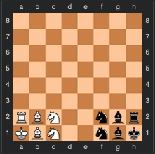

# portfolio-project

**Remember that this project cannot be submitted late.**

Write a class named **ChessVar** for playing an abstract board game that is a variant of chess. The following explanation of the rules assumes some familiarity with the rules of chess - specifically how the pieces move and capture, and what it means for a king to be "in check". If you have any questions about those rules, please don't hesitate to ask.

Here is the starting position for the game:



You will need to keep track of which player's turn it is. As in standard chess, white moves first. The first player to move their king onto row 8 is the winner, unless black finishes the next move after white does, in which case it's a tie. Pieces move and capture the same as in standard chess. As in standard chess, a player is not allowed to expose their own king to check (including moving a piece that was blocking a check such that it no longer does). **Unlike** standard chess, a player is not allowed to put the opponent's king in check (including moving a piece that was blocking a check such that it no longer does).

Locations on the board will be specified using "algebraic notation", with columns labeled a-h and rows labeled 1-8, with row 1 being the start side and row 8 the finish side, as shown in the diagram above.

You're not required to have a function that prints the board, but you will probably find it very useful for testing purposes.

Your ChessVar class must include the following:
* An **init method** that initializes any data members
* A method called **get_game_state** that just returns 'UNFINISHED', 'WHITE_WON', 'BLACK_WON', or 'TIE'. If white has just finished on the last move, then the state is unfinished, since black gets one more move.
* A method called **make_move** that takes two parameters - strings that represent the square moved from and the square moved to.  For example, make_move('b3', 'c4').  If the square being moved from does not contain a piece belonging to the player whose turn it is, or if the indicated move is not legal, or if the game has already been won, then it should **just return False**.  Otherwise it should make the indicated move, remove any captured piece, update the game state if necessary, update whose turn it is, and return True.

Feel free to add whatever other classes, methods, or data members you want.  All data members of a class must be private.  Every class should have an init method that initializes all of the data members for that class.

Here's a very simple example of how the class could be used:
```
game = ChessVar()
move_result = game.make_move('c2', 'e3')
game.make_move('g1', 'f1')
state = game.get_game_state()
```
The file must be named: **ChessVar.py**
